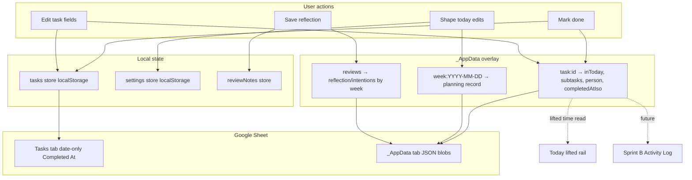

# Sprint A — Data Truth + Today Day Shape

*Status: **DONE** — implemented July 9, 2026; manual UAT pending*  
*Parent: [`BUILD_ROADMAP.md`](./BUILD_ROADMAP.md)*  
*Estimated build order within sprint: A1 → A2 → A3 → A4*

---

## Sprint goal (one sentence)

Teach the app **when things happened** and **how to talk about dates**, then finish Today’s **shape today** layer so the daily home matches the brief — without building Sessions yet.

---

## What Sprint A is NOT

| Out of scope | Why |
|--------------|-----|
| Sessions / timers | Needs Activity Log schema first; Sprint B |
| Day-close retro chips | Depends on Activity Log |
| Drag-from-bench into shape blocks | DnD + assignment rules; Sprint B stretch |
| Project create → Sheet Projects tab | Large write-path; defer unless time allows |
| Daylight engine / lift glow animation | Visual phase; parallel later |
| Waiting-on state | Sprint C |
| Full chip-style Quick Edit | Polish; not blocking |

---

## User stories (shoes-on-the-ground)

### Story 1 — Finish a task on Today, see when

**As** someone on Today at 2:34 PM,  
**I** mark “Submit timesheet” done,  
**I want** it to appear under **Lifted today** with a real time (e.g. “2:34 PM”),  
**So that** I feel proof I shipped today — not a vague “earlier.”

**Acceptance:** Lifted rail shows tasks completed **today** (local calendar day) with formatted time. Tasks completed yesterday do not appear.

---

### Story 2 — Trust that the phone and laptop agree

**As** someone with Sheet connected on phone and laptop,  
**I** write my weekly reflection on laptop,  
**I want** it on my phone after sync,  
**So that** Review isn’t trapped on one device.

**Acceptance:** Reflection + intentions persist in `_AppData` and round-trip on sync.

---

### Story 3 — Know if my edit saved

**As** someone who edits a task title,  
**I want** a quiet indicator that the sheet is saving / saved / failed,  
**So that** I’m not anxious about losing work.

**Acceptance:** Top bar shows sync state when sheet connected (idle / saving / error). Settings still has detail.

---

### Story 4 — Read deadlines humanly

**As** someone scanning Horizon,  
**I want** “Jul 11 · in 3 days” not just “due in 3d”,  
**So that** time-blindness doesn’t make every deadline feel equally far.

**Acceptance:** Horizon rows and task deadline accessories use shared relative+absolute format. Overdue items have their own bucket at top.

---

### Story 5 — Reshape Thursday without replanning the whole week

**As** someone on an admin day whose morning got eaten by meetings,  
**I** tap **shape today ▾**,  
**I want** to see my calendar, adjust today’s focus or note, and optionally set morning/afternoon/evening intentions,  
**So that** Today reflects reality without opening the 4-step week wizard.

**Acceptance:** Shape panel shows calendar (when Google connected), editable today focus, day note, three soft blocks. Changes persist and affect Today header copy. Week plan `completedAt` is **not** cleared.

---

### Story 6 — Sheet user isn’t lied to

**As** someone who connected their Sheet,  
**I** read Settings footnote,  
**I want** it to match reality (subtasks, inToday, week plan **do** sync via `_AppData`),  
**So that** I trust the system.

**Acceptance:** SheetConnect copy updated. No claim that week planning is device-only.

---

## Architecture — how pieces talk



### Key design decision: dual completion timestamps

| Field | Where | Purpose |
|-------|-------|---------|
| `completedAtInDays` | Task model + Sheet column | Week bucketing (Review “shipped this week”), backward compatible |
| `completedAtIso` | `_AppData` task overlay only | Intra-day lifted times, future Activity Log |

**On complete:** set `status: done`, `completedAtInDays: 0`, `inToday: false`, overlay `completedAtIso: new Date().toISOString()`.

**On sheet pull:** Sheet date → `completedAtInDays`; overlay ISO wins for lifted display when present.

**Migration:** Done tasks with `completedAtInDays === 0` and no ISO → lifted shows “earlier today” (honest low confidence per brief §3.6).

---

## Work packages

### A1 — Completion timestamps + lifted rail

**Files**

| File | Change |
|------|--------|
| `src/lib/sheet/app-data.ts` | Add `completedAtIso?: string` to `TaskAppOverlay` |
| `src/lib/store.tsx` | `completeTask` writes ISO to overlay via existing push path |
| `src/lib/sheet/app-data.ts` merge helpers | Merge overlay ISO on hydrate |
| `src/lib/completed-at.ts` | **New** — `isCompletedToday(iso, offset)`, `formatLiftedTime(iso)` |
| `src/components/TodayView.tsx` | Filter lifted by today; real `formatLiftedTime` |
| `src/lib/sheet/app-data.test.ts` | Overlay round-trip |
| `src/lib/completed-at.test.ts` | **New** — timezone edge cases |

**Risks**

| Risk | Mitigation |
|------|------------|
| Weekly Review uses `completedAtInDays` for week filter | Keep writing `completedAtInDays: 0` on complete; ISO is additive |
| Sheet sync overwrites completion | Sheet sets day offset only; overlay ISO preserved on merge (test) |
| Timezone “today” boundary | Use local midnight helpers from `local-date.ts`; test UTC-7 and UTC+12 |

**UAT**

1. Complete task on Today → appears in Lifted with time.
2. Refresh page → still there with same time.
3. Complete task, change system date (or use offset mock) → yesterday’s done tasks not in lifted.

---

### A2 — Relative date language

**Files**

| File | Change |
|------|--------|
| `src/lib/time-display.ts` | **New** — `formatRelativeDay(offset, weekStartsOn?)` → `Jul 11 · in 3 days` |
| `src/lib/lenses.ts` | `deadlineLabel` uses helper; add `formatDeadlineDisplay` export |
| `src/components/DeadlinesView.tsx` | Overdue bucket first; new date copy on rows |
| `src/components/DashboardView.tsx` | Deadline radar uses new format |
| `src/components/TaskCard.tsx` | Optional: deadline accessory uses new format |
| `src/lib/time-display.test.ts` | **New** |

**Risks**

| Risk | Mitigation |
|------|------------|
| `deadlineInDays` is offset not calendar date | Helper converts offset → `Date` via `dateWithOffset` then formats |
| Overdue currently mixed into “today” bucket in `groupDeadlines` | Split `overdue` group in `lenses.ts` `groupDeadlines` |
| Doing-plan labels vs deadline labels | Only change **deadline** display in A2; doing-plan unchanged |

**UAT**

1. Horizon shows **Overdue** section when applicable.
2. A deadline 7 days out reads `Jul 16 · in 7 days` (date varies).
3. Dashboard radar matches Horizon tone.

---

### A3 — Sheet truth + sync indicator

**Files**

| File | Change |
|------|--------|
| `src/lib/sheet/app-data.ts` | Add `REVIEWS_KEY = "reviews"` + parse/serialize |
| `src/lib/store.tsx` | On `saveReviewNotes`, notify app-data push |
| `src/lib/sheet/app-data-notify.ts` | Include reviews in debounced write |
| `src/lib/sheet/sync.ts` | Pull reviews into store on sync |
| `src/components/SheetConnect.tsx` | Fix footnote copy |
| `src/components/TopBar.tsx` | `SheetSyncIndicator` — reads `useSheet()` writeStatus + lastSyncAt |
| `src/components/SheetSyncIndicator.tsx` | **New** — small dot + label |

**Risks**

| Risk | Mitigation |
|------|------------|
| Review notes in tasks store vs settings | Keep in `store.tsx` `reviewNotes`; sync as blob; document key |
| Large review text in _AppData | JSON blob per week key; same as localStorage shape |
| TopBar clutter on mobile | Compact: dot only on phone, label on desktop |

**UAT**

1. Write reflection → sync → second browser/device shows same text after pull.
2. Disconnect sheet → indicator hidden or “local only”.
3. Force write error → indicator shows error state (manual test).

---

### A4 — Day Shape on Today

**Current state:** `TodayScreen` shape expand shows **placeholder** blocks. `DayPlanningPanel.tsx` is **fully built** but **unwired** (calendar, focus, note, all-day disposition).

**Target v1 (Sprint A):**

| Zone | Behavior |
|------|----------|
| Calendar band | Read-only timed + all-day events for **today** via `useWeekCalendarEvents` + `computeDayCommitment` |
| Day focus | Mode / Open / project override — patches **today’s** `WeekDayFocusEntry` only |
| Day note | Textarea, max 400 chars |
| Soft blocks | Morning / afternoon / evening — each holds optional intent `{ kind: mode\|project\|area, id }` + pre-suggest morning from week focus |
| Persistence | `patchWeekDayEntry(weekKey, dateKey, partial)` in settings-store; debounced `_AppData` sync |

**Files**

| File | Change |
|------|--------|
| `src/lib/week-focus.ts` | Extend `WeekDayFocusEntry` with optional `shapeBlocks?: { morning?, afternoon?, evening? }` |
| `src/lib/settings-store.tsx` | Add `patchWeekDayEntry` — does not delete `completedAt` on week record |
| `src/components/TodayView.tsx` | Calendar hook, commitment, handlers, pass to screen |
| `src/components/today/TodayScreen.tsx` | Replace placeholder with `DayShapePanel` or embed `DayPlanningPanel` + block row |
| `src/components/today/DayShapePanel.tsx` | **New** — composes calendar strip + `DayPlanningPanel` focus/note + 3 blocks |
| `src/lib/calendar/use-week-calendar.ts` | Optional: `useDayCalendarEvents` wrapper for single day |

**Interaction with Today bench**

| Change | Effect |
|--------|--------|
| User sets today focus to **Open** via shape | `todayFocusEntry` → open day; bench switches to `inToday` tasks + area rail |
| User sets mode focus | Mode bench recalculates via existing `tasksForTodayModeBench` |
| User only sets shape blocks | **Does not** move tasks; intentions only (brief: soft, no red when plans slip) |

**Risks**

| Risk | Mitigation |
|------|------------|
| Changing focus mid-day confuses approved bench | Show confirm if switching mode with tasks on bench? **Decision: no confirm v1** — user explicitly chose shape; document in UAT |
| No Google Calendar | `CalendarConnect` compact CTA inside shape panel; blocks still work |
| `WeekPlanningOverlay` step 3 vs Today shape both edit `days[dateKey]` | Same data model; last write wins; acceptable |
| Hydration mismatch open day vs mode | Single source: `weekPlanning[weekKey].days[todayDateKey]` |

**Deferred to design mode / Sprint B**

- **Collapsed day-shape strip** — after shaping, show plan as dots on a thin horizontal line (not a text summary). Wireframe: `src/components/design/DayShapeCollapsedStrip.design.tsx`
- Drag task from bench into morning/afternoon/evening block (assigns `doPlan` offset 0 + optional block tag in Activity Log later)
- Day-close “anything else land today?” chips

**UAT**

1. Admin day → shape today → see calendar events (if connected).
2. Switch today to **Open** → bench becomes open-day layout.
3. Set morning block to Creative → persists after refresh.
4. Week plan still shows “you planned this Sunday”; `completedAt` unchanged.

---

## Build sequence inside Sprint A

```
A1 (timestamps) ──┐
                  ├──→ A4 (day shape) — can start after A1 branch merges
A2 (dates) ───────┤
A3 (sync) ────────┘
```

**Recommended order:** A1 → A3 → A2 → A4  
- A3 early so review sync is testable while building UI  
- A2 before A4 so shape panel can reuse date formatters if needed  
- A4 last (most UI touchpoints, benefits from stable data layer)

---

## Test strategy

| Layer | Coverage |
|-------|----------|
| Unit | `completed-at.ts`, `time-display.ts`, `app-data` review parse, `patchWeekDayEntry` reducer |
| Integration | completeTask → overlay → lifted filter |
| Manual UAT | Six user stories above |
| Regression | `npm run build`, `npm test`, smoke `/today` + `/deadlines` + `/weekly-review` |

---

## Risk register (sprint-level)

| # | Risk | Likelihood | Impact | Mitigation |
|---|------|------------|--------|------------|
| R1 | Overlay merge drops `completedAtIso` on sheet pull | Med | High | Explicit merge test; pull applies overlay after sheet map |
| R2 | Day shape focus change empties bench unexpectedly | Low | High | UAT all focus transitions; unit test `todayFocusEntry` |
| R3 | Review sync conflicts (two devices edit same week) | Med | Med | Last-write-wins v1; document; timestamp in blob later |
| R4 | Calendar API quota / auth expiry in shape panel | Med | Low | Graceful error string; shape works without calendar |
| R5 | Scope creep into Sessions | High | Med | This doc’s “NOT” list; no timer UI in A4 |
| R6 | `WeekDayFocusEntry` shape extension breaks merge | Low | Med | `mergeWeekFocusDraft` preserves unknown fields |

---

## Definition of done (Sprint A)

- [ ] All six user stories pass UAT *(manual — see below)*
- [x] `npm run build` clean
- [x] New unit tests pass
- [x] `BUILD_ROADMAP.md` unchanged except sprint status line
- [x] No Sessions / waiting-on / daylight code started
- [x] Plain-English handoff written for user

---

## Self-review (pre-build)

*Reviewed July 9, 2026 before implementation.*

### Completeness check

| Question | Answer |
|----------|--------|
| Does every user story map to a work package? | Yes — stories 1→A1, 2+3+6→A3, 4→A2, 5→A4 |
| Is the data model forward-compatible with Activity Log (Sprint B)? | Yes — `completedAtIso` + shape block intents become log evidence types |
| Are we duplicating DayPlanningPanel? | A4 should **compose** `DayPlanningPanel` for calendar/focus/note, not fork logic |
| Will Today bench break? | Focus changes are intentional; tested in UAT story 5 |

### Gaps identified in review

1. **`patchWeekDayEntry` must exist** — settings-store today only has `completeWeekPlanning` (full replace). Sprint A must add surgical patch. *Added to A4.*
2. **Project sheet write deferred** — acceptable; call out in handoff so user doesn’t expect new projects on Sheet.
3. **Drag-to-block deferred** — brief mentions it; Sprint B to avoid half-DnD. *Documented.*
4. **Activity Log not in Sprint A** — only timestamp **foundation**; no log append yet. Correct per dependency order.

### Blockers before coding

| Blocker | Status |
|---------|--------|
| User approval of this plan | **Approved** — Sprint A built |
| Google Calendar token for calendar band | Optional; graceful degrade |
| Sheet connected for review sync test | Need test sheet or manual skip |

### Verdict

**Plan is ready to implement** after user sign-off. No architectural unknowns remain. Highest-risk item is A4 (Day Shape wiring); recommend implementing A1+A3 first in one PR, A2+A4 in second PR for easier review.

---

## After Sprint A — Sprint B preview

**Sessions v1** should be planned next because:

1. Activity Log schema piggybacks on `completedAtIso` and task/session IDs from A1.
2. Weekly Review “Studio time” is blocked without session durations.
3. Work View “sit with this” needs session state machine.
4. Day-close chips attribute to sessions/shape blocks from A4.

Do not start Sprint B until Sprint A UAT passes.
