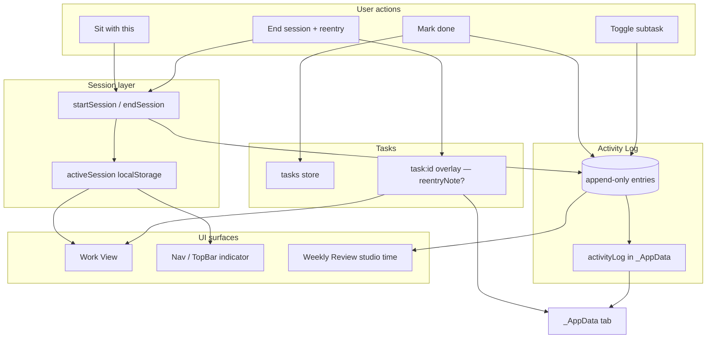

# Sprint B — Sessions + Activity Log v1

*Status: **DONE** — implemented July 9, 2026; manual UAT pending*  
*Parent: [`BUILD_ROADMAP.md`](./BUILD_ROADMAP.md)*  
*Prerequisite: Sprint A code complete (manual UAT recommended before build)*  
*Estimated build order within sprint: B1 → B2 → B3 → B4 → B5 → B6*

---

## Sprint goal (one sentence)

Give the app a **quiet memory of creative time** — start/end sessions from Work View, see you’re “in the studio” from anywhere, and append honest evidence to an Activity Log that powers Review studio time and future Logbook — without background tracking or judgmental metrics.

---

## What Sprint B is NOT

| Out of scope | Why |
|--------------|-----|
| Logbook screen | Needs richer composition UI; Sprint D |
| Shelf | Archive wing; Sprint D |
| Duration memory / “usually 3–4 sessions” averages | Needs 2+ comparable examples; post-Sessions |
| Make/manage bar (creative vs admin split) | Sprint C with full Review ritual |
| Waiting-on state | Sprint C |
| Day-close retro chips (“~1h / ~2h”) | Needs Activity Log + UX pass; stretch or C |
| Day Shape collapsed dot strip | Design mode / daylight polish |
| Drag-from-bench into shape blocks | DnD; stretch after B3 if time |
| Project room “start session” | Work View first; project room in B-stretch |
| Foreground timers / idle detection / auto-tracking | Violates brief §3.6 |
| Logbook-style day narrative UI | Append log only; no reader screen |

---

## User stories (shoes-on-the-ground)

### Story 1 — Sit with a mix without losing the thread

**As** someone opening Work View on “Mix undertow vocals”,  
**I** tap **Sit with this**,  
**I want** a quiet in-session state and, when I end, a one-line *“where did I leave off?”* prompt,  
**So that** next time I open the task I see that note first — not a cold restart.

**Acceptance:** One active session at a time. End session requires optional reentry note. Reentry note shows at top of Work View on return. Session duration recorded (start/end ISO, computed minutes).

---

### Story 2 — Know I’m still in the studio when I navigate away

**As** someone in a session who checks the Lot,  
**I want** a warm indicator in the shell (nav / top bar) linking back to the active task,  
**So that** I don’t forget what I was sitting with.

**Acceptance:** Indicator visible on all main routes while session active. Tap → Work View for that task. Ending session clears indicator.

---

### Story 3 — Weekly Review shows real studio time

**As** someone closing the week on Review,  
**I want** **Studio time** to show hours logged from sessions (not “Coming in app”),  
**So that** the ritual reflects creative time I chose to log.

**Acceptance:** Stat sums `session_end` durations whose `endedAtIso` falls in the selected week (local). Shows `—` or `0m` when no sessions. No make/manage split yet.

---

### Story 4 — Completions become evidence, not just checkboxes

**As** someone marking a task done after a session,  
**I want** the app to record a **task_complete** log entry with timestamp and best-effort attribution,  
**So that** future Day Ledger / Logbook can connect the dot without guessing.

**Acceptance:** `completeTask` appends Activity Log entry with `completedAtIso`. Attribution includes session id if active session on that task, else shape block if placed, else `inToday`, else `unplaced`. Low confidence paths documented; never invent duration.

---

### Story 5 — Phone and laptop agree on session history

**As** someone with Sheet connected,  
**I** end a session on laptop,  
**I want** the log entry on phone after sync,  
**So that** Review studio time isn’t device-trapped.

**Acceptance:** Activity Log blob in `_AppData` round-trips. Active session may be device-local v1 (only one device “in session” at a time is acceptable).

---

### Story 6 — Sessions stay optional and calm

**As** someone who only uses checkboxes,  
**I** never start a session,  
**I want** the app to behave exactly as today — no nagging, no red, no fake studio time,  
**So that** Sessions are additive, not mandatory.

**Acceptance:** No modal blocking complete. No streaks. Timer display understated (elapsed label, not stopwatch anxiety). Skip reentry note = fine.

---

## Architecture — how pieces talk



### Key design decisions

| Decision | Choice | Rationale |
|----------|--------|-----------|
| Log storage | Append-only array in `_AppData` key `activityLog` | Brief §3.6; merge = concat + dedupe by id |
| Active session | `localStorage` + React context | Avoids multi-device “two sessions” complexity v1 |
| Reentry note | `lastReentryNote` on task overlay + copy on `session_end` log entry | Fast read on Work View open; log keeps history |
| Duration | `endedAtIso - startedAtIso` on end; optional manual adjust deferred | Honest; no background ticks |
| Attribution on complete | Rule chain from brief §3.6 | Session → shape block → inToday → unplaced |
| Studio time | Sum `session_end.durationMs` in week range | Powers Review stat only v1 |

### Activity Log entry schema (v1)

```typescript
type ActivityLogEntry =
  | {
      id: string;
      atIso: string;
      kind: "session_start";
      taskId: string;
      projectId: string | null;
    }
  | {
      id: string;
      atIso: string;
      kind: "session_end";
      taskId: string;
      projectId: string | null;
      startedAtIso: string;
      durationMs: number;
      reentryNote?: string;
    }
  | {
      id: string;
      atIso: string;
      kind: "task_complete";
      taskId: string;
      completedAtIso: string;
      attribution: "session" | "shape_block" | "today_bench" | "unplaced";
      sessionId?: string;
      shapeBlock?: "morning" | "afternoon" | "evening";
    }
  | {
      id: string;
      atIso: string;
      kind: "subtask_toggle";
      taskId: string;
      subtaskId: string;
      done: boolean;
    };
```

**Cap:** trim log to last N entries (e.g. 2000) on append if needed — document in implementation.

---

## Work packages

### B1 — Activity Log foundation

**Files**

| File | Change |
|------|--------|
| `src/lib/activity-log.ts` | **New** — types, `appendEntry`, `mergeLogs`, `entriesInWeek`, id factory |
| `src/lib/activity-log.test.ts` | **New** — append, week filter, merge dedupe |
| `src/lib/sheet/app-data.ts` | `ACTIVITY_LOG_KEY`, parse/serialize, `AppDataStore.activityLog` |
| `src/lib/sheet/app-data-notify.ts` | `notifyAppDataActivityLog` |
| `src/lib/sheet-store.tsx` | Pull applies log; push on append |
| `src/lib/sheet/app-data.test.ts` | Round-trip `activityLog` |

**Risks**

| Risk | Mitigation |
|------|------------|
| Log grows unbounded | Cap + document; future archival to monthly blobs |
| Pull merge duplicates | Dedupe by entry `id` on merge |
| Large JSON on sync | Cap; compress only if needed later |

**UAT**

1. Append entry → refresh → still present.
2. Sync → second browser shows new entries after pull.

---

### B2 — Session state machine

**Files**

| File | Change |
|------|--------|
| `src/lib/sessions.ts` | **New** — `ActiveSession`, `start`/`end`/`clear`, elapsed helper |
| `src/lib/sessions-store.tsx` | **New** — context: `activeSession`, `startSession`, `endSession` |
| `src/app/(app)/layout.tsx` | Wrap `SessionsProvider` |
| `src/lib/sheet/app-data.ts` | Optional `lastReentryNote?: string` on `TaskAppOverlay` |
| `src/lib/store.tsx` | `setReentryNote(taskId, note)`; merge overlay field |

**Rules**

- Starting session on task B while A active → end A without note or prompt “switch?” **Decision: auto-end A with log entry, start B** (document in UAT).
- End session → append `session_start` was at start; append `session_end` with duration.
- `task.status` may set `in_progress` on start (optional) — **Decision: set in_progress on start, keep on end until complete**.

**UAT**

1. Start → navigate away → return → still active.
2. End with note → note on task overlay.
3. Start on second task → first session closed in log.

---

### B3 — Work View “Sit with this”

**Files**

| File | Change |
|------|--------|
| `src/components/TaskWorkView.tsx` | Sit / End UI, reentry banner, quiet elapsed label |
| `src/components/SessionEndSheet.tsx` | **New** — end session + optional reentry textarea |
| `src/lib/store.tsx` | `completeTask` ends active session on that task if any |

**UI notes**

- Button near title: **Sit with this** / **End session** (toggle).
- Reentry banner: Caveat-friendly styling deferred; plain text v1.
- No blocking timer; show `42m` elapsed subtly under status.

**UAT**

1. Full flow: sit → work → end → note → leave → return sees note.
2. Complete while in session → session ends, complete log has `attribution: session`.

---

### B4 — Global in-session indicator

**Files**

| File | Change |
|------|--------|
| `src/components/SessionIndicator.tsx` | **New** — warm pill, task title truncate, link to Work View |
| `src/components/TopBar.tsx` | Show indicator desktop |
| `src/components/MobileTabBar.tsx` or layout | Show indicator mobile (above tab bar) |
| `src/lib/navigation.ts` | `openTaskWork` from indicator preserves return path |

**UAT**

1. In session on `/tasks` → indicator visible → tap → Work View.
2. End session → indicator gone everywhere.

---

### B5 — Complete + subtask log hooks

**Files**

| File | Change |
|------|--------|
| `src/lib/store.tsx` | `completeTask` → append `task_complete` with attribution |
| `src/lib/completion-attribution.ts` | **New** — rule chain using active session, `shapeBlockTasks`, `inToday` |
| `src/lib/store.tsx` | `toggleSubtask` → append `subtask_toggle` |
| `src/components/TodayView.tsx` | Pass today shape context into attribution helper |

**Attribution helper inputs**

- `activeSession?.taskId`
- `weekPlanning[weekKey].days[today].shapeBlockTasks`
- `task.inToday`

**UAT**

1. Complete from Today bench without session → `today_bench` or `shape_block` if placed.
2. Complete unrelated task → `unplaced`.

---

### B6 — Weekly Review studio time

**Files**

| File | Change |
|------|--------|
| `src/lib/studio-time.ts` | **New** — `studioMinutesInWeek(log, weekRange)` |
| `src/lib/studio-time.test.ts` | **New** |
| `src/components/WeeklyReviewView.tsx` | Replace placeholder stat with formatted duration |
| `src/lib/store.tsx` or sessions store | Expose `activityLog` read-only to consumers |

**Display**

- `< 60m` → `42m`
- `≥ 60m` → `2.5h` (one decimal max)
- Zero → `—` with hint “Start a session from Work View”

**UAT**

1. Two sessions totalling 90m in current week → Review shows `1.5h`.
2. Previous week switcher → only that week’s sessions count.

---

## Build sequence inside Sprint B

```
B1 (activity log) ──→ B2 (session state) ──→ B3 (work view)
                              │
                              ├──→ B4 (shell indicator)
                              │
                              └──→ B5 (complete hooks) ──→ B6 (review stat)
```

**Recommended order:** B1 → B2 → B3 → B4 → B5 → B6  
- B1 first — everything appends to log  
- B2 before UI — state machine stable  
- B3+B4 can parallelize after B2  
- B5 needs shape context from Sprint A  
- B6 last — read-only aggregate

---

## Test strategy

| Layer | Coverage |
|-------|----------|
| Unit | `activity-log.ts`, `sessions.ts`, `studio-time.ts`, `completion-attribution.ts` |
| Integration | start → end → Review sum; complete → log attribution |
| Manual UAT | Six user stories above |
| Regression | `npm run build`, `npm test`, smoke Work View + Review |

---

## Risk register (sprint-level)

| # | Risk | Likelihood | Impact | Mitigation |
|---|------|------------|--------|------------|
| R1 | Active session lost on refresh | Med | Med | Persist `activeSession` in localStorage; restore on load |
| R2 | User forgets to end session | High | Low | Indicator persistent; optional “still sitting?” — **not v1** |
| R3 | Log sync conflicts two devices | Med | Med | Last-write-wins merge by id; document |
| R4 | Studio time double-counts | Low | High | Only `session_end` counts; test partial weeks |
| R5 | Scope creep into duration memory | High | Med | NOT list; no averages in B6 |
| R6 | Work View footer overlaps session UI | Med | Low | Adjust fixed footer when session bar present |
| R7 | `in_progress` status confuses Lot filters | Med | Med | Document; optional revert status on end |

---

## Definition of done (Sprint B)

- [ ] All six user stories pass UAT *(manual)*
- [x] `npm run build` clean
- [x] New unit tests pass
- [x] `BUILD_ROADMAP.md` sprint map updated
- [x] No Logbook / Waiting-on / daylight code started
- [x] Plain-English handoff written for user

---

## Sprint A handoff (status for Sprint B)

| Sprint A item | Status |
|---------------|--------|
| A1 timestamps + lifted rail | **Shipped** |
| A2 relative dates + Horizon overdue | **Shipped** |
| A3 review sync + sync indicator | **Shipped** |
| A4 day shape panel | **Shipped** (task-to-block assignment; not per-block mode chips) |
| Collapsed dot strip | **Deferred** — design wireframe only |
| Manual UAT (6 stories) | **Pending** — recommend spot-check before B build |

---

## Self-review (pre-build)

*Drafted July 9, 2026 — pending user approval.*

### Completeness check

| Question | Answer |
|----------|--------|
| Does every user story map to a work package? | Yes — 1→B3, 2→B4, 3→B6, 4→B5, 5→B1, 6→cross-cutting |
| Does B build on Sprint A without rework? | Yes — `completedAtIso`, `shapeBlockTasks`, review sync |
| Is schema forward-compatible with Logbook? | Yes — append-only log is source for diary composition |
| Are we building “attention pointer” separate from session? | **Deferred** — v1 “Sit with this” starts session; pointer can split later |

### Gaps identified

1. **Manual “log 2 hours”** — brief mentions; defer to B-stretch or C unless user wants it in B.
2. **Project room session start** — defer; Work View is primary entry.
3. **Day-close chips** — need Activity Log first; defer to B-stretch or C.
4. **Make/manage bar** — explicitly Sprint C per roadmap.

### Blockers before coding

| Blocker | Status |
|---------|--------|
| User approval of this plan | **Pending** |
| Sprint A manual UAT | Recommended, not strict |
| Sheet connected for log sync test | Optional |

### Verdict

**Plan is ready for review.** Highest-risk item is B2+B3 (session lifecycle + Work View UX). Recommend B1+B2 in first PR, B3–B6 in second.

---

## After Sprint B — Sprint C preview

**Waiting-on + Review depth** because:

1. Waiting-on is a task state + Lot lens — independent of Sessions but fits “peace of mind” layer.
2. Make/manage bar needs session totals **by work mode** (creative vs admin).
3. Day-close retro chips can attribute to sessions once B5 attribution exists.

Do not start Sprint C until Sprint B UAT passes.
