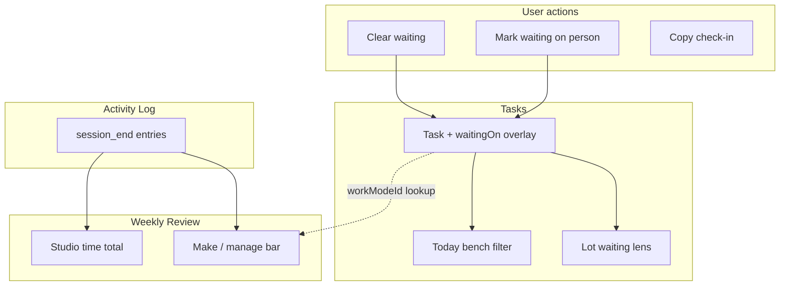

# Sprint C — Waiting-on + Review Depth

*Status: **DONE***  
*Parent: [`BUILD_ROADMAP.md`](./BUILD_ROADMAP.md)*  
*Prerequisite: Sprint B code complete (Sessions + Activity Log)*  
*Estimated build order within sprint: C1 → C2 → C3 → C4 → C5*

---

## Sprint goal (one sentence)

Give the app **peace of mind about other people** (waiting-on shelf + dashboard whisper) and **close the weekly ritual loop** with a make/manage studio-time bar — without new screens or automatic sending.

---

## What Sprint C is NOT

| Out of scope | Why |
|--------------|-----|
| Shelf / Logbook / Recipes | Sprint D archive wing |
| Duration memory averages | Needs history depth; post-Sprint C |
| Auto-send nudge emails/DMs | Brief: copy-only check-in |
| Waiting-on as a separate Sheet column | `_AppData` overlay v1 |
| Fifth top-level nav screen | Waiting-on is a Lot lens + whisper |
| Daylight engine / lift glow | Layer 7 |
| Collapsed day-shape dot strip | Design mode |
| Drag-to-shape-block DnD | Optional stretch; not blocking C |
| Full Day Ledger UI | Computed view later; only log retro chips as stretch |

---

## User stories (shoes-on-the-ground)

### Story 1 — Park something on someone else’s plate

**As** someone waiting on a venue reply,  
**I** mark the task **waiting on Sam** in Quick Edit,  
**I want** it to leave Today and stop nagging me in the main bench,  
**So that** I trust it’s parked — not forgotten.

**Acceptance:** Waiting requires a person name. Task drops off Today (`inToday: false`). Task still completable from waiting lens. `waitingOn.sinceIso` set.

---

### Story 2 — Browse the waiting shelf

**As** someone checking “what’s blocked on others,”  
**I** open the Lot → **Waiting** lens,  
**I want** tasks grouped with **quiet for N days** and the person’s name,  
**So that** I see distance from the light without anxiety.

**Acceptance:** New Lot lens shows only `waitingOn` tasks. Sorted by longest quiet first. Person name visible on row.

---

### Story 3 — Dashboard whisper

**As** someone glancing at the Dashboard,  
**I want** a calm line like **“3 waiting on others”** when applicable,  
**So that** I get peace of mind without opening the Lot.

**Acceptance:** Whisper links to Lot waiting lens. Hidden when count is 0. No red styling.

---

### Story 4 — Gentle nudge after a week

**As** someone whose task has been quiet 8 days,  
**I want** a **copy check-in** suggestion (prewritten text),  
**So that** I can follow up without the app sending anything for me.

**Acceptance:** At ≥7 days quiet, task row shows copy button. Clipboard gets polite template with person name + task title. Nothing auto-sends.

---

### Story 5 — Review shows make vs manage time

**As** someone closing the week,  
**I want** a quiet **make / manage** bar under Studio time,  
**So that** I see whether the week was more creative or admin — from real sessions.

**Acceptance:** Bar shows hours split derived from `session_end` + task `workModeId` at read time. Creative + outreach → **make**; admin + errands → **manage**. Empty side shows 0, not fake balance.

---

### Story 6 — Phone and laptop agree on waiting

**As** someone with Sheet connected,  
**I** mark waiting on laptop,  
**I want** it on phone after sync,  
**So that** the waiting shelf isn’t device-trapped.

**Acceptance:** `waitingOn` in task overlay round-trips via `_AppData`.

---

## Architecture — how pieces talk



### Key design decisions

| Decision | Choice | Rationale |
|----------|--------|-----------|
| Waiting state | `waitingOn?: { personId, personName, sinceIso }` on task + overlay | Person picker exists; timestamp powers “quiet for N days” |
| Leave Today | Auto `inToday: false` when marking waiting | Brief §4.12 |
| Lot lens | Add `LensId: "waiting"` — 5th tab | Brief: lens + section, not new screen |
| Make/manage split | `creative` + `outreach` → make; `admin` + `errands` → manage | Brief names creative vs admin; outreach/errands heuristic documented |
| Session mode attribution | Lookup task `workModeId` when aggregating (snapshot optional stretch) | Avoid schema migration unless mode changes mid-week become a problem |
| Nudge | Copy to clipboard only | Brief hard rule |

### Waiting-on type (v1)

```typescript
export type WaitingOn = {
  personId: string | null;
  personName: string;
  sinceIso: string;
};

// Task + TaskAppOverlay
waitingOn?: WaitingOn | null;
```

---

## Work packages

### C1 — Waiting-on data model + sync

**Files**

| File | Change |
|------|--------|
| `src/lib/types.ts` | `WaitingOn` type on `Task` |
| `src/lib/sheet/app-data.ts` | `waitingOn` on `TaskAppOverlay`; merge/serialize |
| `src/lib/store.tsx` | `setTaskWaiting`, `clearTaskWaiting`; overlay push |
| `src/lib/sheet/app-data.test.ts` | Round-trip `waitingOn` |

**Risks**

| Risk | Mitigation |
|------|------------|
| Person without waiting conflates with assignee | Waiting is explicit toggle, not automatic from `personName` |
| Sheet pull drops waiting | Merge in `mergeTaskOverlay` |

**UAT**

1. Mark waiting → refresh → still waiting.
2. Sync → second device shows waiting after pull.

---

### C2 — Mark / clear waiting in UI + Today exclusion

**Files**

| File | Change |
|------|--------|
| `src/components/TaskDetailSheet.tsx` | Waiting toggle + person required; clears waiting |
| `src/components/TaskWorkView.tsx` | Optional waiting chip + clear |
| `src/lib/lenses.ts` | `activeLot` excludes waiting tasks; `isWaitingTask()` helper |
| `src/components/TodayView.tsx` | Mode bench / open day filters exclude waiting |
| `src/components/TaskCard.tsx` | “waiting · Sam” accessory when applicable |

**Rules**

- Cannot mark waiting without `personName` (picker or typed).
- Marking waiting → `inToday: false`, `waitingOn.sinceIso = now`.
- Clearing waiting → `waitingOn: null` (task returns to normal Lot).

**UAT**

1. Task on Today → mark waiting → disappears from Today bench.
2. Clear waiting → reappears in Lot (not auto back to Today).

---

### C3 — Lot waiting lens + quiet days + nudge

**Files**

| File | Change |
|------|--------|
| `src/lib/types.ts` | Extend `LensId` with `"waiting"` |
| `src/lib/lenses.ts` | `groupByWaiting()` — one group or by person |
| `src/lib/waiting-on.ts` | **New** — `quietDaysSince`, `nudgeCopyText`, `waitingTasks` |
| `src/lib/waiting-on.test.ts` | **New** |
| `src/components/TasksLot.tsx` | 5th lens tab; nudge copy button on rows |
| `src/components/TaskCard.tsx` | Quiet-days label in waiting lens |

**UAT**

1. Waiting lens only shows waiting tasks.
2. 7+ day task shows copy nudge → clipboard has sensible text.

---

### C4 — Dashboard whisper

**Files**

| File | Change |
|------|--------|
| `src/components/DashboardView.tsx` | Whisper strip when `waitingCount > 0` |
| Link target | `/tasks` with lens state — query `?lens=waiting` or client default |

**UAT**

1. Dashboard shows “2 waiting on others” with link.
2. Zero waiting → whisper hidden.

---

### C5 — Make / manage bar on Weekly Review

**Files**

| File | Change |
|------|--------|
| `src/lib/studio-time.ts` | `studioMsByBucket(log, tasks, weekRange)` |
| `src/lib/studio-time.test.ts` | Bucket split tests |
| `src/lib/work-mode-buckets.ts` | **New** — `makeManageBucket(workModeId)` |
| `src/components/WeeklyReviewView.tsx` | Quiet bar under stats: make vs manage hours |

**Display**

- Two segments proportional to hours (not % of 40h week).
- Labels: **make** (creative work) · **manage** (admin/errands).
- If no sessions: bar hidden (studio time already shows `—`).

**UAT**

1. Week with only creative sessions → make side full.
2. Mixed week → bar reflects both.

---

## Build sequence inside Sprint C

```
C1 (data model) ──→ C2 (mark/clear + Today filter)
                         │
                         ├──→ C3 (Lot lens + nudge)
                         │
                         └──→ C4 (Dashboard whisper)

C5 (make/manage bar) — can start after C1; uses Activity Log from B, independent of waiting
```

**Recommended order:** C1 → C2 → C3 → C4 → C5  
- C5 can parallelize with C3/C4 once `studio-time` helpers exist

---

## Test strategy

| Layer | Coverage |
|-------|----------|
| Unit | `waiting-on.ts`, `work-mode-buckets.ts`, `studioMsByBucket` |
| Integration | mark waiting → Lot lens → clear; session aggregation |
| Manual UAT | Six user stories above |
| Regression | `npm run build`, `npm test` |

---

## Risk register (sprint-level)

| # | Risk | Likelihood | Impact | Mitigation |
|---|------|------------|--------|------------|
| R1 | Waiting confused with person assignee | Med | Med | Separate toggle; accessory copy “waiting on” |
| R2 | Today bench feels empty after many waiting | Low | Low | Intentional; whisper + lens are the home |
| R3 | Make/manage heuristic wrong for outreach | Med | Low | Document mapping; user modes customizable later |
| R4 | Task mode changes after session skews bar | Low | Med | Optional `workModeId` on `session_end` stretch |
| R5 | Nudge feels pushy | Med | Med | Copy-only; no badges/streaks |
| R6 | Fifth lens crowds mobile tabs | Med | Low | Short label “Waiting”; scroll tabs if needed |

---

## Definition of done (Sprint C)

- [ ] All six user stories pass UAT
- [ ] `npm run build` clean
- [ ] New unit tests pass
- [ ] `BUILD_ROADMAP.md` sprint map updated
- [ ] No Shelf / Logbook / daylight code started
- [ ] Plain-English handoff written for user

---

## Sprint B handoff (status for Sprint C)

| Sprint B item | Status |
|---------------|--------|
| Activity Log + sync | **Shipped** |
| Sessions + reentry notes | **Shipped** |
| Studio time stat | **Shipped** |
| Mark done during session (one click) | **Fixed** |
| Manual UAT | **Recommended** |

---

## Stretch (if time allows)

| Item | Notes |
|------|-------|
| Day-close retro chips (~1h / ~2h) | Append `user_stated_duration` to Activity Log; Today optional prompt |
| `workModeId` on `session_end` log entry | Immune to task mode edits |
| Deep-link `/tasks?lens=waiting` on first paint | URL sync for Dashboard whisper |

---

## Self-review (pre-build)

*Drafted July 9, 2026 — pending user approval.*

### Completeness check

| Question | Answer |
|----------|--------|
| Does every user story map to a work package? | Yes — 1–2→C2, 2→C3, 3→C4, 4→C3, 5→C5, 6→C1 |
| Does C build on B without rework? | Yes — Activity Log powers make/manage |
| Is waiting-on a new screen? | No — lens + whisper only |
| Are we auto-sending nudges? | No — copy only |

### Gaps identified

1. **Outreach/errands bucket mapping** — heuristic for v1; Settings override deferred.
2. **Waiting without person** — blocked by design; person is required.
3. **Sheet Status column for waiting** — deferred; overlay only.

### Blockers before coding

| Blocker | Status |
|---------|--------|
| User approval of this plan | **Pending** |
| Sprint B on main / committed | **Done** (`3f862d2`) |

### Verdict

**Plan is ready for review.** Highest-risk item is C2+C3 (waiting must feel calm, not punitive). Recommend C1+C2 first PR, C3–C5 second.

---

## After Sprint C — Sprint D preview

**Shelf → Logbook → Recipes** because:

1. Archive wing needs honest `completedAtIso` (A) + Activity Log (B).
2. Logbook composes from sessions, reflections, and ships — C’s Review depth completes the weekly ritual input.
3. Recipes need Horizon + duration memory (later).

Do not start Sprint D until Sprint C UAT passes.
