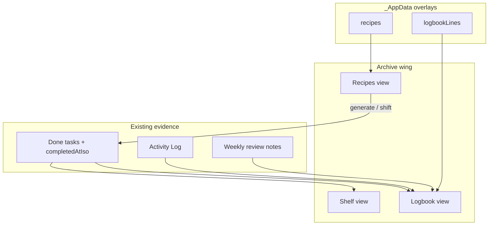

# Sprint D — Archive Wing (Shelf → Logbook → Recipes)

*Status: **PLANNED** — reviewed, not started*  
*Parent: [`BUILD_ROADMAP.md`](./BUILD_ROADMAP.md)*  
*Prerequisite: Sprint C code complete (Waiting-on + Review depth)*  
*Estimated build order within sprint: D1 → D2 → D3 (D3 may split to Sprint E if scope swells)*

---

## Sprint goal (one sentence)

Give the app a **permanent archive** — what you shipped (Shelf), who you were while making it (Logbook), and how you plan releases backward from anchor dates (Recipes) — all built from evidence already in the system, never analytics or streaks.

---

## What Sprint D is NOT

| Out of scope | Why |
|--------------|-----|
| Daylight engine / lift glow polish | Layer 7; parallel-safe |
| Collapsed day-shape dot strip | Design mode |
| Duration memory averages (“usually 3–4 sessions”) | Needs 2+ comparable examples; post-D stretch |
| Day-close retro chips UI | Optional stretch; log schema can accept later |
| Full then-vs-now AI narrative | Logbook v1 = composed facts + gentle resurfacing |
| Recipe → Google Calendar write | Recipes v1 generates tasks only; calendar sync later |
| Fifth bottom-tab nav item on phone | Archive wing shares one **Archive** entry (Shelf default) |
| Charts, streaks, completion rates | Brief hard rule — mirror, not report card |
| Re-open / un-ship from Shelf | Tap → read-only task record or Work View (done state) |

---

## User stories (shoes-on-the-ground)

### Story 1 — Browse everything I’ve shipped

**As** someone who forgets how much they’ve actually finished,  
**I** open **Shelf**,  
**I want** shipped work newest-first, grouped by month, with project and area visible,  
**So that** I see a wall of proof — not a productivity score.

**Acceptance:** Only `status === "done"` tasks. Sorted by `completedAtIso` (fallback `completedAtInDays`). Month group headers. Filter by life area and/or project. No ember/red anywhere. Empty state is kind.

---

### Story 2 — Project room shows its shipped work

**As** someone in a project room,  
**I want** a **Shipped** section for that project,  
**So that** the corner of the studio shows its discography without opening Shelf.

**Acceptance:** Reuses Shelf row component. Shows last N with “see all on Shelf” link filtered to project.

---

### Story 3 — Flip through a studio diary

**As** someone with time blindness who doubts their own progress,  
**I** open **Logbook**,  
**I want** days assembled from what I already did — sessions ended, tasks shipped, reflection saved —  
**So that** I see evidence I was working without writing a journal from scratch.

**Acceptance:** Day pages built at read time from Activity Log + done tasks + review notes. Optional **line in the log** per day (user text, `_AppData`). Skipping the line is invisible — no gaps, no shame. No metrics.

---

### Story 4 — Optional line at day’s end

**As** someone who wants to leave a handwritten note,  
**I** add one line to today’s log page,  
**So that** future-me sees mood/context alongside facts.

**Acceptance:** `logbookLines: Record<dateKey, string>` in `_AppData`. One line per calendar day max v1. Syncs across devices.

---

### Story 5 — Plan a release backward from a date

**As** someone dropping an EP in October,  
**I** create a **Recipe** with an anchor date and milestone chain,  
**I want** tasks generated with deadlines relative to the anchor,  
**So that** the whole chain shifts when the release date moves.

**Acceptance:** Recipe stores anchor + milestones (title, offsetDays, optional workModeId). “Apply recipe” creates linked tasks. Moving anchor re-computes milestone `deadlineInDays` / `doPlan` for generated tasks. Save recipe as reusable template.

---

### Story 6 — Archive syncs on phone and laptop

**As** someone with Sheet connected,  
**I** ship on laptop and write a log line,  
**I want** Shelf and Logbook lines on phone after sync,  
**So that** the archive isn’t device-trapped.

**Acceptance:** `logbookLines` + `recipes` blobs in `_AppData`. Shelf reads done tasks (already in Sheet + overlay).

---

## Architecture — how pieces talk



### Key design decisions

| Decision | Choice | Rationale |
|----------|--------|-----------|
| Shelf data source | Done tasks in task store | No duplicate ship index; `completedAtIso` from Sprint A |
| Shelf sort | ISO desc, fallback `completedAtInDays` | Honest timestamps |
| Logbook composition | Read-time merge of log + ships + reflections | Brief: assembled, never demanded |
| Logbook user text | `logbookLines` keyed by `YYYY-MM-DD` | Small blob; optional |
| Recipes storage | `recipes[]` in `_AppData` v1 | No Sheet tab migration yet |
| Generated tasks | `recipeId` + `milestoneId` on task overlay | Enables cascade re-shift |
| Nav | Single `/archive` route with Shelf \| Logbook \| Recipes tabs | Avoids bottom-bar sprawl on phone |
| Project room | Shelf section component reuse | DRY |

---

## Work packages

### D1 — Shelf (shipped archive)

**Files (expected)**

| File | Change |
|------|--------|
| `src/lib/shelf.ts` | **New** — `shippedTasks()`, `groupByMonth()`, filters |
| `src/lib/shelf.test.ts` | **New** |
| `src/components/ShelfView.tsx` | **New** — month groups, filters, rows |
| `src/app/(app)/archive/page.tsx` | **New** — archive shell, default Shelf tab |
| `src/components/nav.tsx` | Add Archive nav (desktop sidebar; mobile: under Review or replace Plan — TBD in build) |
| `src/components/ProjectsView.tsx` or project detail | Shipped section stub → link to Shelf |

**Row content:** title · project · life-area color · shipped date (`formatDeadlineDisplay` style + relative)

**UAT**

1. Mark 3 tasks done on different days → Shelf shows 3, newest on top, correct months.
2. Filter by project → only that project’s ships.
3. Tap row → opens Work View (read-only done) or task record sheet.

---

### D2 — Logbook v1

**Files (expected)**

| File | Change |
|------|--------|
| `src/lib/logbook.ts` | **New** — `composeDayPage()`, `composeMonthSummary()` |
| `src/lib/logbook.test.ts` | **New** |
| `src/lib/sheet/app-data.ts` | `logbookLines` blob parse/serialize |
| `src/lib/store.tsx` | `saveLogbookLine(dateKey, text)` |
| `src/components/LogbookView.tsx` | **New** — day pager, fact list, optional line input |
| `src/app/(app)/archive/page.tsx` | Logbook tab |

**Day page sections (v1)**

1. Tasks shipped that day (from `task_complete` log + tasks)
2. Sessions ended (duration + reentry snippet)
3. Weekly reflection if that day was review day (optional footnote)
4. User’s one line (editable)

**UAT**

1. Ship a task + end a session → Logbook today shows both.
2. Add a line → refresh → still there.
3. Sync → second device shows line.

---

### D3 — Recipes v1

**Files (expected)**

| File | Change |
|------|--------|
| `src/lib/types.ts` | `Recipe`, `RecipeMilestone`, overlay `recipeId?` / `milestoneId?` on Task |
| `src/lib/recipes.ts` | **New** — CRUD, apply, shift anchor |
| `src/lib/recipes.test.ts` | **New** |
| `src/lib/sheet/app-data.ts` | `recipes` array in store |
| `src/components/RecipesView.tsx` | **New** — list, editor, chain preview |
| `src/components/RecipeEditor.tsx` | **New** — anchor date, milestone list |
| `src/app/(app)/archive/page.tsx` | Recipes tab |

**Recipe model (v1)**

```typescript
type RecipeMilestone = {
  id: string;
  title: string;
  offsetDays: number; // negative = before anchor
  workModeId?: string | null;
};

type Recipe = {
  id: string;
  name: string;
  projectId: string | null;
  anchorDate: string; // YYYY-MM-DD
  milestones: RecipeMilestone[];
  createdAt: number;
};
```

**UAT**

1. Create recipe “EP Drop” anchor Oct 1 → 3 milestones → generates tasks with deadlines.
2. Move anchor +2 weeks → linked tasks shift.
3. Recipe saves in `_AppData` → sync → phone sees recipe.

---

## Build order & PR strategy

| Phase | Ship | User-visible win |
|-------|------|------------------|
| **D1** | Shelf + nav + project shipped strip | Immediate pride / proof |
| **D2** | Logbook reader + log lines | Memory repair |
| **D3** | Recipes editor + task generation | Release planning |

Recommend **D1 as first PR** (smallest, validates archive nav). D2 second. D3 third or split to Sprint E if editor swells.

---

## Risks

| Risk | Mitigation |
|------|------------|
| Done tasks lack `completedAtIso` (pre-Sprint A) | Fallback to `completedAtInDays`; show “date approximate” only if needed |
| Logbook feels empty early | Kind empty states; show sessions/ships even without user lines |
| Recipe cascade breaks manual edits | Only auto-shift tasks with `recipeId` + `milestoneId` still linked |
| Mobile nav crowding | One Archive route with internal tabs |
| Scope creep on Recipes | v1 = task generation only; no calendar write |

---

## Manual UAT checklist (full sprint)

- [ ] Shelf: 3+ ships, month groups, filters, no red
- [ ] Project room shipped section links to Shelf
- [ ] Logbook: today shows ship + session after normal use
- [ ] Logbook line saves and syncs
- [ ] Recipe: create → tasks → move anchor → tasks shift
- [ ] Archive reachable from desktop sidebar and mobile
- [ ] `npm test` + `npm run build` clean

---

## After Sprint D — what unlocks

| Next | Why |
|------|-----|
| Duration memory | Recipes + sessions + ships = comparable examples |
| Day-close retro chips | Activity Log schema ready |
| Daylight / visual polish | Layer 7, parallel-safe |
| Horizon ↔ Recipes sibling UI | Shared timeline components |

---

## Plain English

Sprint D builds the **archive wing** of the studio: **Shelf** is the wall of finished work, **Logbook** is the diary assembled from what you already did, and **Recipes** is backward planning from a release date. Still no streaks, no charts, no background tracking.

---

## Verdict

**Plan is ready for review.** Start with **D1 (Shelf)** — highest user delight per line of code. Approve to build.
