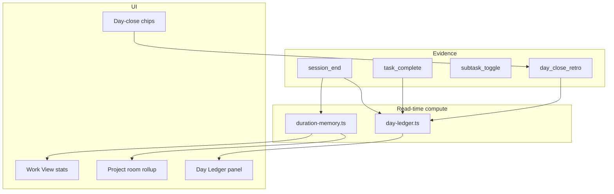

# Sprint E — Time Memory (Lane 1)

*Status: **DONE** — Sprint E shipped*  
*Parent: [`BUILD_ROADMAP.md`](./BUILD_ROADMAP.md)*  
*Prerequisite: Sprint D code complete (Archive wing v1)*  
*Estimated build order within sprint: E1 → E2 → E3 → E4 → E5 → E6*

---

## Sprint goal (one sentence)

Repair **time estimation** and **end-of-day clarity** by surfacing honest duration facts from sessions and retro chips — on tasks, projects, and a read-only Day Ledger — without averages, streaks, or background tracking.

---

## What Sprint E is NOT

| Out of scope | Why |
|--------------|-----|
| Daylight engine / lift glow | Layer 7 — separate track |
| Collapsed day-shape dot strip | Layer 2 deferral / design polish |
| Drag-to-shape-block DnD | Today UX polish, not time memory |
| Logbook then-vs-now resurfacing | Sprint D stretch; needs history depth |
| Recipe milestone spacing from history | Unlocks *after* duration memory ships |
| Auto-send / notifications for day-close | Brief: optional, skippable, never gates |
| Full Day Ledger correction UI | v1 = read-only computed view; edit attribution later |
| Work archetype tagging (“full mix”) | Post–Sprint E; needs comparable task clustering |
| Foreground timers / idle detection | Brief hard rule |

---

## User stories (shoes-on-the-ground)

### Story 1 — See how long this task has actually taken

**As** someone mid-mix on a multi-session task,  
**I** open Work View,  
**I want** a quiet line like *“so far: 3 sessions · ~4.25h · 4/6 subtasks”*,  
**So that** I can plan the rest of my day without guessing.

**Acceptance:** Stats derived from `session_end` rows for this `taskId` only. Subtask count from task. No “usually X hours” until **2+ comparable finished tasks** with same `workModeId` (v1 heuristic). Cold start shows facts only.

---

### Story 2 — Project room shows studio time rollup

**As** someone in a project room,  
**I want** *“12h logged across 4 active tasks”* when sessions exist,  
**So that** I see project rhythm without opening Review.

**Acceptance:** Sum `session_end.durationMs` for tasks where `projectId` matches. Hide when zero. Informational tone only.

---

### Story 3 — Optional day-close retro

**As** someone ending the workday,  
**I want** to tap **~1h** or **~2h** (or skip) for “anything else land today?”,  
**So that** unlogged studio time can be stated honestly without a timer.

**Acceptance:** Appends `day_close_retro` to Activity Log with `dateKey` + `durationMs`. Skip is one tap / dismiss. Never blocks navigation. Same day can update (replace prior retro for dateKey v1).

---

### Story 4 — Read today’s Day Ledger

**As** someone with time blindness,  
**I** open **Today’s ledger** (read-only),  
**I want** calendar bands · shape intent · ships (with attribution) · sessions · stated retro · **“no signal”** gaps,  
**So that** I see what the system actually knows about today — not a fake hour-by-hour grid.

**Acceptance:** Computed at read time from Activity Log + tasks + week day entry + calendar read API. Gaps labeled **no signal**, never “you did nothing.” No editing in v1.

---

### Story 5 — Sync remembers retro and log

**As** someone with Sheet connected,  
**I** log a retro chip on laptop,  
**I want** it on phone after sync,  
**So that** Day Ledger isn’t device-trapped.

**Acceptance:** New log kinds round-trip via `_AppData` `activityLog` (existing blob).

---

## Architecture — how pieces talk



### Key design decisions

| Decision | Choice | Rationale |
|----------|--------|-----------|
| Duration source | `session_end.durationMs` + `day_close_retro` | Brief §3.6 + §4.17 |
| Comparable tasks | Same `workModeId`, status `done`, ≥2 examples | v1 heuristic; no archetype tags yet |
| Averages display | Median **range** (“usually 3–5 sessions”) | Brief: ranges not promises |
| Cold start | “So far: N sessions · ~Xh” only | No fake history |
| Day Ledger | Computed view, not stored | Brief: append-only log + compose |
| Retro scope | Whole-day stated duration v1 | Per-task manual log deferred |
| Confidence UI | Solid = fact, muted = user-stated retro | Light v1; full pattern in Layer 7 |
| Admin/errands tasks | Show session stats; exclude from “similar work” | Brief: single-tap admin excluded from archetype |

### Activity Log extension (v1)

```typescript
| {
    id: string;
    atIso: string;
    kind: "day_close_retro";
    dateKey: string; // YYYY-MM-DD local
    durationMs: number;
  }
```

Existing kinds unchanged. Cap + merge rules from Sprint B still apply.

---

## Work packages

### E1 — Duration memory library

**Files**

| File | Change |
|------|--------|
| `src/lib/duration-memory.ts` | **New** — `taskSessionStats`, `projectSessionRollup`, `comparableDoneTasks`, `similarWorkHint` |
| `src/lib/duration-memory.test.ts` | **New** |
| `src/lib/activity-log.ts` | `dayCloseRetroEntries`, filter helpers |
| `src/lib/activity-log.test.ts` | Retro kind tests |

**Core API (sketch)**

```typescript
type TaskSessionStats = {
  sessionCount: number;
  totalMs: number;
  totalLabel: string; // formatStudioDuration
  spanDays: number; // distinct local days with session_end
  subtasksDone: number;
  subtasksTotal: number;
};

type SimilarWorkHint = {
  sessionRange: [number, number];
  hourRange: [number, number];
  sampleCount: number;
} | null;
```

**UAT**

1. Task with 2 session_end rows → stats show 2 sessions + sum.
2. Task with 0 sessions → stats hidden (not “0h”).
3. 2+ done tasks same mode → hint appears; 1 done → no hint.

---

### E2 — Work View “so far” strip

**Files**

| File | Change |
|------|--------|
| `src/components/TaskWorkView.tsx` | Stats strip under title / above reentry note |
| `src/components/TaskSessionStats.tsx` | **New** — presentational component |

**Copy rules**

- Always: `so far: {N} sessions · ~{Xh} · {done}/{total} subtasks` (omit subtasks segment if none)
- When hint: second line `similar {mode}: usually {a–b} sessions (~{h1–h2}h)` — label as *your past work*
- Tone: `text-muted`, never red, never “behind schedule”

**UAT**

1. Open task after 2 sessions → strip visible.
2. Complete task → strip still readable on done task (optional: show final totals).

---

### E3 — Project room session rollup

**Files**

| File | Change |
|------|--------|
| `src/components/ProjectDetailView.tsx` | Rollup under project why |
| `src/lib/duration-memory.ts` | `projectSessionRollup(projectId, tasks, log)` |

**UAT**

1. Two tasks in project with sessions → rollup shows combined hours.
2. No sessions → no rollup line (not empty box).

---

### E4 — Day-close retro chips

**Files**

| File | Change |
|------|--------|
| `src/components/DayCloseSheet.tsx` | **New** — “Anything else land today?” + ~1h / ~2h / ~3h / Skip |
| `src/lib/store.tsx` | `appendDayCloseRetro(dateKey, durationMs)` |
| `src/components/today/TodayScreen.tsx` | Optional entry: end-of-day chip or “Close the day” text button |
| `src/lib/sessions-store.tsx` | If active session at day-close → end first (or block with message) |

**Rules**

- One retro entry per `dateKey` v1 — new chip replaces previous for that day.
- Skip dismisses sheet; no log entry.
- Evening-only nudge optional stretch — v1: manual button in Today footer.

**UAT**

1. Tap ~2h → Day Ledger shows stated time.
2. Skip → no entry, no shame copy.
3. Sync → retro appears on second device.

---

### E5 — Day Ledger (computed, read-only)

**Files**

| File | Change |
|------|--------|
| `src/lib/day-ledger.ts` | **New** — `composeDayLedger(dateKey, …)` |
| `src/lib/day-ledger.test.ts` | **New** |
| `src/components/DayLedgerPanel.tsx` | **New** — sections with confidence styling |
| `src/components/today/TodayScreen.tsx` | Collapsible “Today’s ledger” or link from shape header |

**Ledger sections (v1 order)**

1. **Calendar** — read-only timed bands (existing calendar hook)
2. **Shape** — morning/afternoon/evening assigned tasks + note if any
3. **Shipped** — task_complete with attribution label (`session`, `shape block`, `today`, `unplaced`)
4. **Sessions** — session_end list with duration + task title
5. **Stated** — day_close_retro if present
6. **Gaps** — explicit “no signal” between major bands where neither calendar nor log covers (heuristic v1: don’t over-fit)

**UAT**

1. Ship task during session → ledger shows ship attributed to session.
2. Empty day → kind empty state (“quiet day — no signal yet”).
3. Retro + sessions both show without double-counting as “fact” (retro labeled user-stated).

---

### E6 — Tests, docs, verify

| File | Change |
|------|--------|
| `docs/SPRINT-E.md` | Status → DONE when complete |
| `docs/BUILD_ROADMAP.md` | Layer 6 partial → done |
| `AGENTS.md` | Pointer to Sprint E |

**UAT (full sprint)**

- [x] Work View stats match session log
- [x] Project rollup matches sum of task sessions
- [x] Day-close retro → ledger stated section
- [x] Day Ledger attribution labels correct for session vs unplaced complete
- [x] No similar-work hint until 2+ comparable done tasks
- [x] `npm test` + `npm run build` clean

---

## Build order & PR strategy

| Phase | Ship | User-visible win |
|-------|------|------------------|
| **E1** | duration-memory lib + log kind | Foundation |
| **E2** | Work View strip | Immediate daily value |
| **E3** | Project rollup | Project room depth |
| **E4** | Day-close retro | Closes honest day loop |
| **E5** | Day Ledger panel | Time-blindness mirror |

Recommend **E1+E2 first PR**, **E3+E4 second**, **E5 third**.

---

## Risks

| Risk | Mitigation |
|------|------------|
| Similar-work hint too noisy | Only show when ≥2 comparables; hide for admin/errands |
| Double-counting retro + sessions in user’s head | Clear labels: *logged sessions* vs *you stated* |
| Day Ledger too empty early | Same kind empty states as Logbook; calendar still adds structure |
| Ledger performance | Single-day compose; memoize on dateKey |
| Active session at day-close | End session prompt before retro, or exclude overlap in copy |

---

## After Sprint E — what unlocks

| Next | Why |
|------|-----|
| Recipe spacing suggestions | Uses comparable duration history |
| Logbook then-vs-now | Richer evidence base |
| Confidence UI pattern (Layer 7) | Ledger already has fact vs stated |
| Daylight / lift glow | Visual track, independent |
| Archetype tags (“full mix”) | Finer comparables than workModeId alone |

---

## Plain English

Sprint E teaches the app to **remember how long your work actually takes** — from sessions you already log — and to **close the day honestly** with optional retro chips. You’ll see it on the task, in the project room, and in a read-only **Day Ledger** that shows facts, stated time, and “no signal” gaps — never a report card.

---

## Verdict

**Plan is ready for review.** Highest value first: **E1 + E2 (Work View stats)**. Approve to build.
